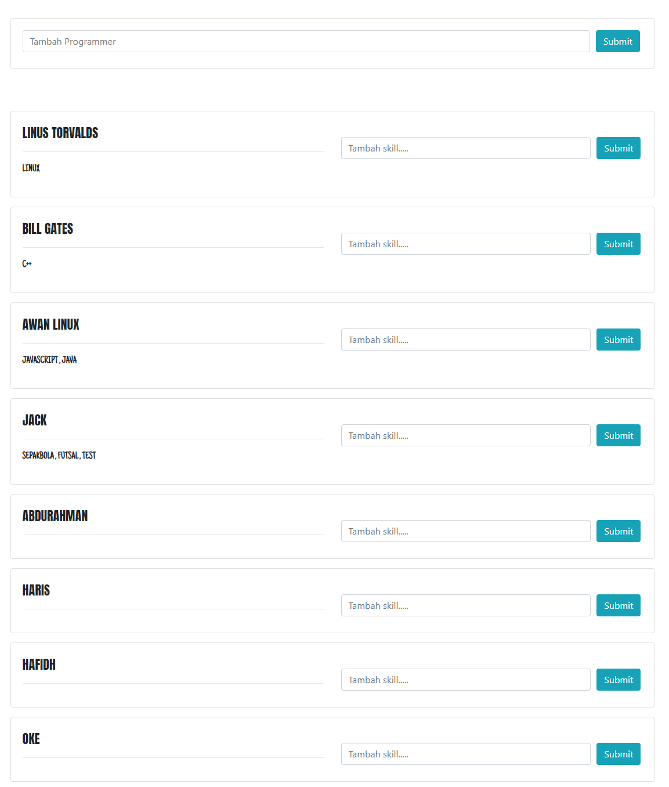

<h3>PENGERTIAN REST API </h3>
Pengertian REST API adalah Standar komunikasi yang digunakan pada platform berbasis web.
 
<h3>KEGUNAAN JSON</h3>
JSON pada REST API yaitu hasil dari komunikasi yang menghasilkan data yang dapat di konsumsi oleh aplikasi

