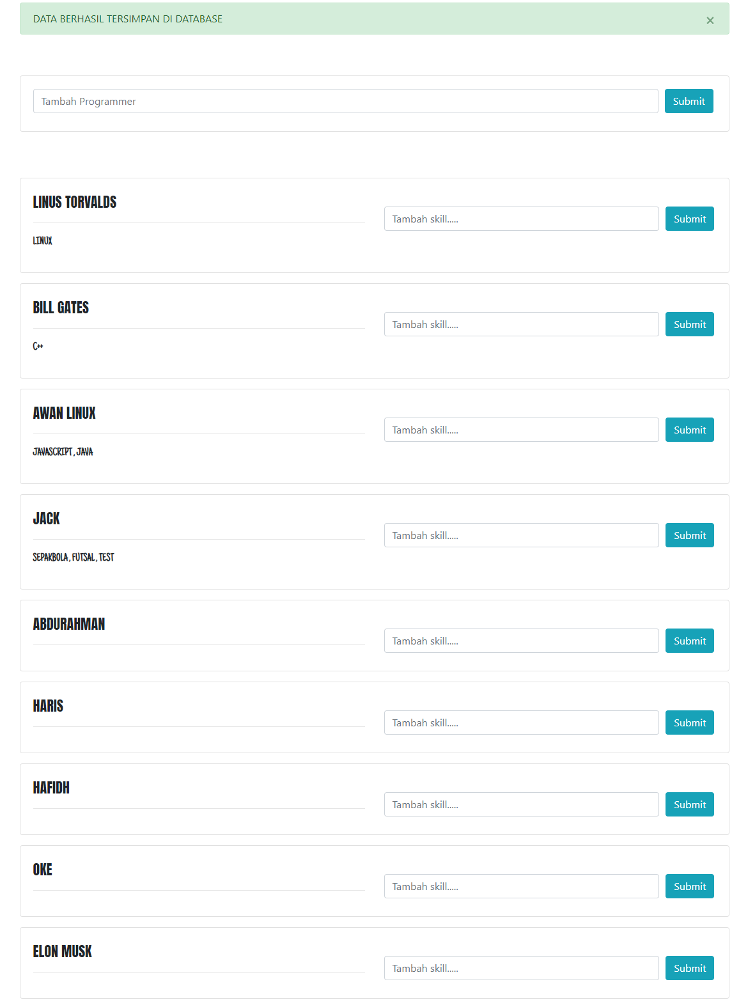

<h3>PENGERTIAN REST API </h3>
Pengertian REST API adalah Standar komunikasi yang digunakan pada platform berbasis web.
 
<h3>KEGUNAAN JSON</h3>
JSON pada REST API yaitu hasil dari komunikasi yang menghasilkan data yang dapat di konsumsi oleh aplikasi baik berbasis <i>mobile</i> ataupun website
 
<h3>SOAL NO 6</h3>
 
<h3>HALAMAN UTAMA TAMBAH LIST PROGRAMMER</h3>

 
<h3>NOTIFIKASI BERHASIL MENYIMPAN USERS DATA KE DATABASE</h3>

 
<h3>NOTIFIKASI BERHASIL MENYIMPAN SETIAP SKILLS PADA PROGRAMMER</h3>

